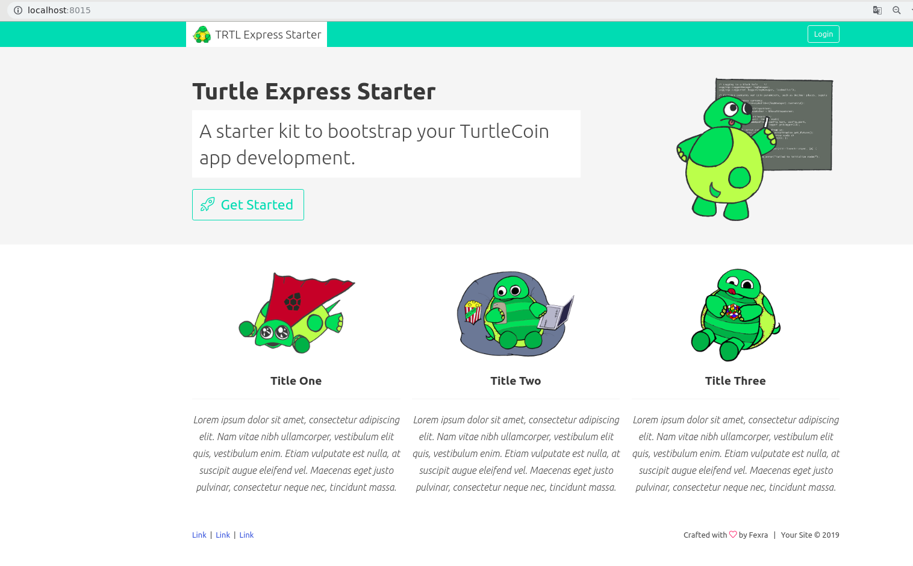
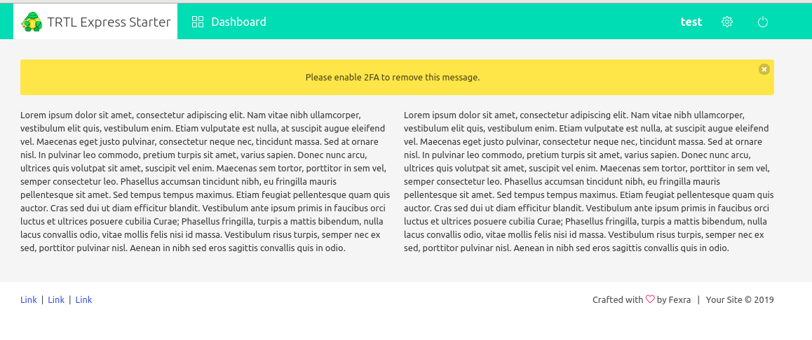

# TRTL Express Starter
A boiler template for node.js using express.js for quick development. Comes with user system, dashboard and settings, including 2FA and password management. Further comes with a few small middleware scripts for RabbitMQ, user/input validation and recapcha and 2FA verification. It uses knex.js for sql query building and supports mysql, postgres, sqlite, and oracle. knex.js also builds your database schema for your, see the schema.js file in /utils/db.




## Requirements
- node.js 8+
- knex.js compatible database
- RabbitMQ (optional)

## Includes
- MVC framework - express.js 
- User system - registration, login, 2FA, password manager - passport.js
- SQL query/schema builder - knex.js
- Template system - pug.js
- Public frontend page
- App dashboard page
- User settings page
- Welcome + ToS page
- Input validation middleware
- RabbitMQ lib - amqplib
- Google Recaptcha middleware
- Bulma 
- Swanson Assets

## Setup

Clone the repository:

```
git clone https://github.com/fexra/turtle-express-starter myproject
cd myproject
```

Install dependencies: 

```
sudo apt update
sudo apt install mariadb-server nodejs
```

Create the database in the MariaDB command line:

```sql
mysql -u root -p
CREATE DATABASE mydatabase;
exit
```

Copy the example .env file to .env and fill it out

```
cp .env-example .env
```

Here's an example of a completed .env file:

```
APP_PORT=8015
APP_SECRET=appsecret
APP_COOKIE_SECRET=appcookiesecret

DB_HOST=localhost
DB_PORT=3306
DB_USER=root
DB_PASS=yourdbpassword
DB_NAME=mydatabase

RABBITMQ_USER=
RABBITMQ_PASS=

RECAPTCHA_SITE_KEY=
RECAPTCHA_SECRET_KEY=
```

Install the nodejs modules:


```
npm i
```
Start the application:

```
npm start
```

The application will be served on whatever port you configured in .env for `APP_PORT`.
